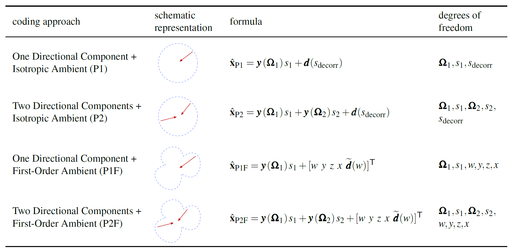

# ambisonics_param_coding_AES_2023
Scripts for generating audio and evaluating listening experiment results associated with the paper "Perceptual Comparison of Parametric Spatial Audio Codings for Binaural Rendering". The following table gives an overview of spatial audio coding approaches.

## Setup
To run the scripts for generating stimuli, Python 3.10 with pip is required. Install dependencies by running `pip install -r requirements.txt`. To compute the PEMO-Q and BAM-Q metrics, a current MATLAB installation is required. 
To compute BAM-Q, you need to checkout submodules recursively. For PEMO-Q, you need to manually download some MATLAB scripts. Find further instructions in `./objective_evaluation/pemo-q/`.

## Instructions for running the code
Run stimulus generation scripts from the directory `./generate_stimuli/`; run the metrics computation from `./objective_evaluation/`; run the listening experiment evaluation from `./evaluate_listening_experiment_results/`.

